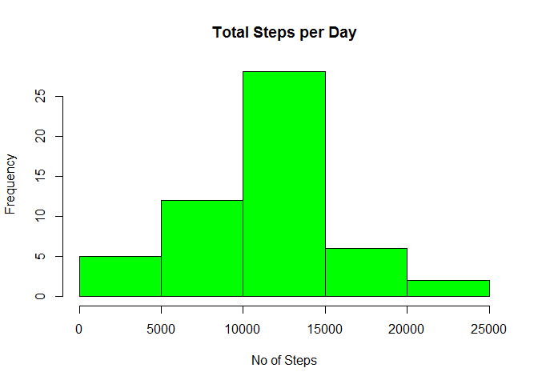
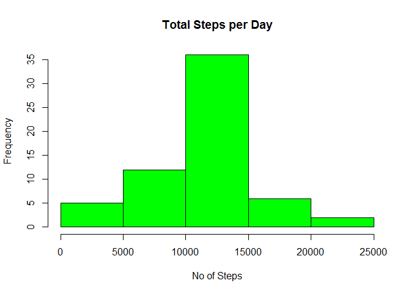
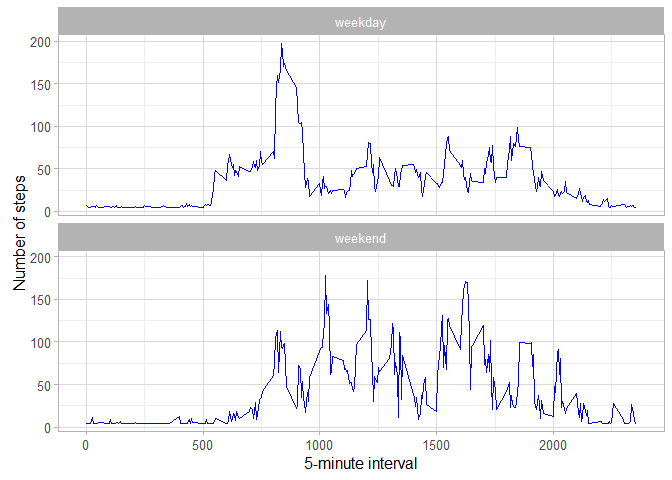

# Reproducible Research: Peer Assessment 1


```r
library(ggplot2)
```

```
## Warning: package 'ggplot2' was built under R version 3.2.3
```

```r
#library(scales)
library(Hmisc)
```

```
## Warning: package 'Hmisc' was built under R version 3.2.3
```

```
## Loading required package: lattice
```

```
## Loading required package: survival
```

```
## Loading required package: Formula
```

```
## Warning: package 'Formula' was built under R version 3.2.3
```

```
## 
## Attaching package: 'Hmisc'
```

```
## The following objects are masked from 'package:base':
## 
##     format.pval, round.POSIXt, trunc.POSIXt, units
```

## Loading and preprocessing the data


```r
data <- read.csv("activity\\activity.csv")
```

## What is mean total number of steps taken per day?

```r
steps_per_day <- aggregate(steps ~ date, data, sum)

hist(steps_per_day$steps, main = "Total Steps per Day", col="Green", xlab="No of Steps")
```



```r
rmean <- mean(steps_per_day$steps)
rmedian <- median(steps_per_day$steps)
```

The mean is 

```
## [1] 10766.19
```
and the median is  

```
## [1] 10765
```
## What is the average daily activity pattern?

```r
steps_by_interval <- aggregate(steps ~ interval, data, mean)

plot(steps_by_interval$interval,steps_by_interval$steps, type="l", xlab="Interval", ylab="Number of Steps",main="Average Number of Steps per Day by Interval")
```


```r
max_interval <-steps_by_interval[which.max(steps_by_interval$steps),1]
```
Most Steps at:

```
## [1] 835
```
## Imputing missing values

```r
numMissingValues <- length(which(is.na(data$steps)))
DataImputed <- data
DataImputed$steps <- impute(data$steps, fun=mean)
Imputed_steps_per_day <- aggregate(steps ~ date, DataImputed, sum)
hist(Imputed_steps_per_day$steps, main = paste("Total Steps per Day"), col="Green", xlab="No of Steps")
```



```r
Imputedmean <- mean(Imputed_steps_per_day$steps)
Imputedmedian <- median(Imputed_steps_per_day$steps)
meandiff<-Imputedmean-rmean
mediandiff<-Imputedmedian-rmedian
stepsdiff<-sum(Imputed_steps_per_day$steps)-sum(steps_per_day$steps)
```
The Imputedmean is 

```
## [1] 10766.19
```
and the Imputedmean is  

```
## [1] 10766.19
```
The mean difference is 

```
## [1] 0
```
The median difference is 

```
## [1] 1.188679
```
The stepsdiff difference is 

```
## [1] 86129.51
```
## Are there differences in activity patterns between weekdays and weekends?

```r
#DataImputed$week <-  ifelse(as.POSIXlt(DataImputed$date)$wday %in% c(0,6), 'weekend', 'weekday')
#newStepsPerDay$WeekDay <- ifelse(weekdays(as.Date(newStepsPerDay$date))==c("Sunday"), "weekend", #"weekday") 
DataImputed$week <-ifelse(weekdays(as.Date(DataImputed$date))==c("Sunday"), "weekend", "weekday") 
AverageDataImputed <- aggregate(steps ~ interval + week, data=DataImputed, mean)
ggplot(AverageDataImputed, aes(interval, steps)) + 
    geom_line(color="blue") + 
    facet_wrap(~ week,nrow=2,ncol=1) +
    xlab("5-minute interval") + 
    ylab("Number of steps")+theme_light()
```


